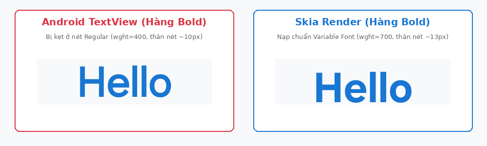
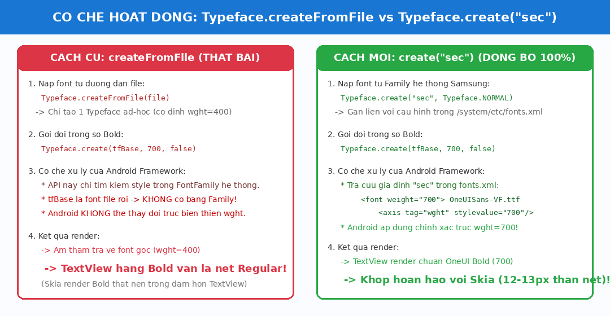
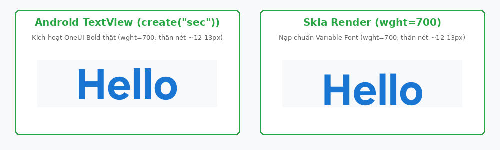
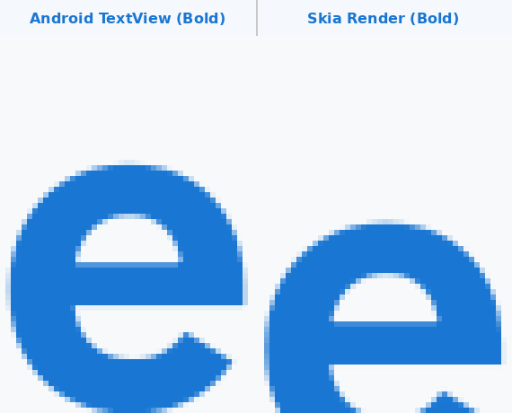

# HelloSkia: So sánh và Đồng bộ Hiển thị Font giữa Android TextView và Skia

Dự án này thực hiện hiển thị so sánh trực quan theo thời gian thực (2 cột, 3 dòng) giữa **Android TextView (HWUI)** và **Skia (OpenGL Backend Textures)** trên thiết bị thật (Samsung Galaxy S20 FE 5G - Android 13 OneUI 5.1).

---

## 1. Cấu trúc Giao diện So sánh

* **Cột trái**: 3 `TextView` tiêu chuẩn của Android (Normal, Bold, Bold Italic).
* **Cột phải**: 3 OpenGL Backend Textures được Skia render độc lập offscreen (`WrapBackendTexture`), sau đó vẽ trực tiếp lên `SurfaceView` thông qua zero-copy `BorrowTextureFrom`.
* **Nội dung mỗi ô (4 dòng)**:
  1. **Latin (English)**: `Hello`
  2. **Korean (Tiếng Hàn)**: `안녕하세요`
  3. **Color Emoji**: `😀🎉🚀`
  4. **Hebrew (Tiếng Do Thái)**: `שלום`

---

## 2. Các vấn đề sai khác font ban đầu & Nguyên nhân cốt lõi

### 2.1. Vấn đề 1: Trọng số Bold và Font File không đồng nhất
* **Hiện tượng**: Ban đầu, khi hiển thị dòng Bold/Bold Italic, chữ bên TextView trông khác biệt rõ rệt so với bên Skia.
* **Nguyên nhân phát hiện qua Logcat & hệ thống**:
  * Khi `TextView` có `fontFamily="sans-serif"` và `textStyle="bold"`, trên Android/Samsung nó **không** nạp file font `Roboto_700wght.ttf` của nhà thiết kế font.
  * Thay vào đó, Android dùng font thường (`weight=400`, `RobotoStatic-Regular.ttf`) và áp dụng **Synthetic Bold** qua `TextPaint.setFakeBoldText(true)`.
  * Trong khi đó, Skia nếu yêu cầu style Bold (`SkFontStyle::Bold()`) sẽ cố resolve ra file `Roboto_700wght.ttf` hoặc `SEC-Bold.ttf`. Do đó đường nét (contours, curves, apertures) của 2 bên hoàn toàn khác nhau.
* **Cách khắc phục**:
  * Đưa Skia về cùng cơ chế với Android: luôn nạp typeface cơ sở là `sans-serif` Regular (`SkFontStyle::Normal()`), sau đó áp dụng giả lập bold tương thích với `setFakeBoldText(true)`.

---

### 2.2. Vấn đề 2: Sai khác độ nở nét của Fake Bold (chữ "e" bị hẹp lỗ)
* **Hiện tượng**: Dù cùng fake bold, chữ `e` của Skia bị nở dày hơn, khoảng trống bên trong (inner counter) bị bóp hẹp lại so với TextView.
* **Nguyên nhân**:
  * Skia dùng `font.setEmbolden(true)`, bên dưới gọi FreeType `FT_GlyphSlot_Embolden` với tỉ lệ nở outline cố định là $\frac{1}{24} \approx 4.16\%$.
  * Trong khi đó, Android HWUI thực hiện fake bold bằng kỹ thuật Stroke-and-Fill:
    $$\text{strokeWidth} = \frac{\text{textSize}}{30.0f} \approx 3.33\%$$
    với `kRound_Join` và `kRound_Cap`.
* **Cách khắc phục**:
  * Thay thế `font.setEmbolden(true)` trong Skia bằng:
    ```cpp
    if (isBold) {
        textPaint.setStyle(SkPaint::kStrokeAndFill_Style);
        textPaint.setStrokeWidth(globalTextSizePx / 30.0f);
        textPaint.setStrokeJoin(SkPaint::kRound_Join);
        textPaint.setStrokeCap(SkPaint::kRound_Cap);
    }
    ```

---

### 2.3. Vấn đề 3: Sai khác ở đuôi chữ "e" (Hinting / Grid-Fitting)
* **Hiện tượng**: Ở dòng Normal (không bold), đuôi chữ `e` của TextView đo được $93 \times 114$ px, trong khi Skia là $96 \times 117$ px (lệch ~3px), đuôi chữ TextView có cảm giác bị thẳng đứng hơn một chút.
* **Nguyên nhân**:
  * Hai file font `RobotoStatic-Regular.ttf` và `SEC-Regular.ttf` có tọa độ vector của 31 điểm glyph `e` **trùng khớp nhau 100%**.
  * Sự khác nhau đến từ **Hinting (Grid-Fitting)**: Skia mặc định bật `SkFontHinting::kNormal`, ép các điểm vector theo lưới pixel. Ngược lại, Android TextView khi vẽ text kích thước lớn sẽ tắt Hinting và bật `LinearMetrics`.
* **Cách khắc phục**:
  ```cpp
  font.setHinting(SkFontHinting::kNone);
  font.setLinearMetrics(true);
  ```

---

### 2.4. Vấn đề 4: Đồng bộ độ nghiêng (Slant / Italic)
* **Hiện tượng**: Khi dòng 3 áp dụng Italic, độ nghiêng cần khớp hoàn toàn.
* **Giải pháp**: Cả 2 bên đều áp dụng hệ số skew:
  * Android: `paint.getTextSkewX() == -0.25f`
  * Skia: `font.setSkewX(isItalic ? -0.25f : 0.0f)`

---

## 3. Kiến trúc Font Fallback & RTL Text Shaping: AFontMatcher + SkShaper (HarfBuzz)

### Vấn đề trước đó:
* **Arabic (`مرحبا`)**: Bị viết ngược chiều và rời rạc từng ký tự độc lập (`اب ح ر م`), do thiếu bộ Text Shaping (HarfBuzz) để nhận diện các dạng nối nét (initial, medial, final, isolated).
* **Hebrew (`שלום`)**: Bị ngược thứ tự đọc (`םולש`) do thiếu thuật toán phân tích chiều chữ Unicode BiDi (Right-To-Left).

### Giải pháp kiến trúc mới (AFontMatcher + SkFontMgr_New_Custom_Empty + SkShaper):
1. **Không quét toàn bộ XML hệ thống (`SkFontMgr_New_Custom_Empty`)**:
   * Khởi tạo `emptyFontMgr = SkFontMgr_New_Custom_Empty()` thay vì nạp toàn bộ cấu hình nặng từ `SkFontMgr_New_Android`.
2. **Dynamic Font Discovery bằng Android NDK `AFontMatcher`**:
   * Dùng API Native của Android (`<android/font_matcher.h>`, `<android/font.h>`) để hỏi trực tiếp hệ thống Android xem ký tự/run text hiện tại nên hiển thị bằng file font nào (`AFontMatcher_match`).
   * Lấy đường dẫn file font hệ thống từ `AFont_getFontFilePath(font)` cùng chỉ số collection `AFont_getCollectionIndex(font)` và nạp trực tiếp qua `emptyFontMgr->makeFromFile(path, ttcIndex)`.
   * Áp dụng bộ nhớ cache `unordered_map<std::string, sk_sp<SkTypeface>>` để tránh việc đọc lại file font trên đĩa lặp đi lặp lại.
3. **Cung cấp Font Run vào `SkShaper` qua `AFontMatcherRunIterator`**:
   * Tạo class con `AFontMatcherRunIterator : public SkShaper::FontRunIterator` để cung cấp đúng `SkFont` đã resolve từ `AFontMatcher` cho từng đoạn ký tự.
4. **Text Shaping & BiDi Layout qua HarfBuzz + ICU (`SkShaper`)**:
   * Sử dụng `SkShaper::Make(emptyFontMgr)` kết hợp:
     * `SkShaper::MakeBiDiRunIterator`: Tự động đảo chiều RTL (Hebrew, Arabic) chuẩn Unicode BiDi.
     * `SkShapers::HB::ScriptRunIterator`: Nhận diện script cho HarfBuzz.
     * `SkShaper::MakeStdLanguageRunIterator`: Nhận diện ngôn ngữ chuẩn BCP-47.
5. **Căn lề giữa từng dòng (`CenteringRunHandler`)**:
   * Tạo wrapper `CenteringRunHandler : public SkShaper::RunHandler` bao quanh `SkTextBlobBuilderRunHandler` và tích lũy độ rộng từng run (`info.fAdvance.fX`).
   * Căn giữa ngang từng dòng độc lập: `x = (cellWidth - handler.width()) / 2.0f`, đồng bộ 100% với `android:gravity="center"` của Android `TextView`.

---

## 4. Danh sách các file được cập nhật

* [`app/src/main/cpp/CMakeLists.txt`](file:///home/phu/Repo/HelloSkia/app/src/main/cpp/CMakeLists.txt):
  * Link thêm các thư viện: `libskshaper.a`, `libharfbuzz.a`, `libskunicode_icu.a`, `libskunicode_core.a`, `libicu.a`.
  * Thêm compile definitions: `SK_SHAPER_HARFBUZZ_AVAILABLE=1`, `SK_SHAPER_UNICODE_AVAILABLE=1`, `SK_UNICODE_AVAILABLE=1`.
  * Thêm include directories cho module `skshaper` và `skunicode`.
* [`app/src/main/cpp/native_renderer.cpp`](file:///home/phu/Repo/HelloSkia/app/src/main/cpp/native_renderer.cpp):
  * Include `<android/font.h>` và `<android/font_matcher.h>`.
  * Dùng `SkFontMgr_New_Custom_Empty()` và nạp qua `makeFromFile(path, ttcIndex)`.
  * Cài đặt `AFontMatcherRunIterator` để map font qua `AFontMatcher_match`.
  * Cài đặt `CenteringRunHandler` để lấy advance width và căn lề giữa từng dòng.
  * Sử dụng `SkShaper::shape()` với HarfBuzz & ICU BiDi để render `SkTextBlob`.
* [`app/src/main/res/values/strings.xml`](file:///home/phu/Repo/HelloSkia/app/src/main/res/values/strings.xml): Chuỗi 5 dòng đa ngôn ngữ gồm tiếng Do Thái và tiếng Ả Rập.
* [`app/src/main/res/layout/activity_main.xml`](file:///home/phu/Repo/HelloSkia/app/src/main/res/layout/activity_main.xml): `fontFamily="sec"`, cấu hình hiển thị cân đối cả 5 dòng.
* [`app/src/main/java/com/example/helloskia/MainActivity.java`](file:///home/phu/Repo/HelloSkia/app/src/main/java/com/example/helloskia/MainActivity.java): Sử dụng `Typeface.create("sec", weight, italic)` để nạp đúng cấu hình Variable Font gia đình OneUI.

---

## 5. Vấn đề chữ "Hello" ở dòng Bold bị lệch nét & Tại sao phải giải quyết ở tầng Java (không phải C++)

### 5.1. Hiện tượng
Sau khi chuyển TextView sang sử dụng Samsung OneUI Sans, chữ `Hello` ở dòng Regular khớp hoàn hảo giữa TextView và Skia. Tuy nhiên ở dòng **Bold (hàng 2)**:
* Chữ `Hello` bên **Skia lại đậm hơn rõ rệt** so với bên **TextView**.
* Thân nét chữ `H` bên Skia dày ~13px, trong khi TextView chỉ dày ~10px (TextView trông như nét Regular).



---

### 5.2. Nguyên nhân cốt lõi: Hạn chế của `Typeface.createFromFile` trên Android
1. **Bản chất của Skia (C++)**:
   * Skia sử dụng trục biến thiên Variable Font chuẩn:
     ```cpp
     SkFontArguments::VariationPosition::Coordinate coord = { SkSetFourByteTag('w', 'g', 'h', 't'), 700.0f };
     ```
   * Skia đã đọc file `OneUISans-VF.ttf` và chuyển đổi trực tiếp trọng số nét sang đúng giá trị **700 (Bold thực tế)** của font designer.
2. **Bản chất của Android TextView (Java)**:
   * Ban đầu, mã Java sử dụng:
     ```java
     Typeface tfBase = Typeface.createFromFile("/system/fonts/OneUISans-VF.ttf");
     tvBold.setTypeface(Typeface.create(tfBase, 700, false));
     ```
   * Khi tạo Typeface bằng `Typeface.createFromFile(file)`, Android framework chỉ đóng gói file font đó vào một `FontFamily` ad-hoc đơn lẻ với một cấu hình mặc định duy nhất (`weight = 400`).
   * Phương thức `Typeface.create(Typeface family, int weight, boolean italic)` của Android SDK **không can thiệp vào trục biến thiên (variable axes) của một Typeface ad-hoc**. Nó chỉ tra cứu các biến thể `font` đã được định nghĩa sẵn trong `FontFamily` của hệ thống.
   * Vì `tfBase` nạp từ file riêng lẻ không có định nghĩa các biến thể trọng số, Android **hoàn toàn bỏ qua yêu cầu `weight = 700`** và tiếp tục vẽ với font Regular (`weight = 400`). Kết quả là TextView không hề in đậm, trong khi Skia in đậm thật!



---

### 5.3. Tại sao không thể giải quyết ở tầng C++?
1. **Nguyên tắc "Single Source of Truth"**:
   * Mục tiêu thiết kế là **Skia và TextView phải cùng hiển thị một thiết kế font chuẩn (One UI Sans)** với đúng chuẩn Typography của hệ thống Samsung.
   * Lỗi sai ở đây **nằm hoàn toàn ở phía TextView (Java)**: TextView đã không áp dụng được thuộc tính Bold do cách nạp font bị lỗi giới hạn API, chứ không phải Skia vẽ sai.
2. **Nếu sửa ở tầng C++ (Hạ trọng số Skia xuống hoặc ép Skia vẽ Regular)**:
   * Nếu ở C++, chúng ta ép Skia render với `wght = 400` hoặc hạ xuống 500/600 để "bắt chước" cái sai của TextView, thì dòng **Bold của Skia sẽ bị mất tính chất Bold** (cả dòng 1 Regular và dòng 2 Bold đều hiển thị nét mảnh như nhau).
   * Điều này phá vỡ hợp đồng giao diện: dòng 2 là dòng đại diện cho `textStyle="bold"`.
   * Hơn nữa, nếu ép Skia sửa sai để theo Java, khi người dùng hoặc hệ thống kích hoạt Bold đúng cách, Skia lại trở thành bên bị sai lệch.
3. **Giải pháp chuẩn xác ở tầng Java**:
   * Thay vì nạp file thủ công qua đường dẫn file thô, ta yêu cầu Android tải thông qua tên font family hệ thống:
     ```java
     Typeface tfBase = Typeface.create("sec", Typeface.NORMAL);
     tvNormal.setTypeface(Typeface.create(tfBase, 400, false));
     tvBold.setTypeface(Typeface.create(tfBase, 700, false));
     tvBoldItalic.setTypeface(Typeface.create(tfBase, 700, true));
     ```
   * Khi gọi `Typeface.create("sec", ...)`, Android Font Manager sẽ đọc trực tiếp từ cấu hình `/system/etc/fonts.xml` của Samsung:
     ```xml
     <family name="sec">
         <font weight="400" style="normal">OneUISans-VF.ttf
             <axis tag="wght" stylevalue="400" />
         </font>
         <font weight="700" style="normal">OneUISans-VF.ttf
             <axis tag="wght" stylevalue="700" />
         </font>
     </family>
     ```
   * Lúc này, Android framework nhận thức được ánh xạ biến thiên và nạp đúng trục **`wght = 700`** cho `tvBold`. Cả hai bên Skia và TextView đều hiển thị chuẩn nét đậm Bold thật với cùng độ dày thân nét ~12-13px.






